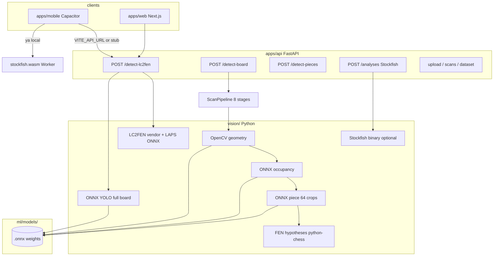

# Roadmap: migración offline (apps/api → mobile/browser)

Objetivo: **photo → board detection → pieces → FEN → Stockfish → analysis** sin FastAPI, en iPhone/Android vía Capacitor (WebView + Web Workers + WASM).

Principio: **portar/adaptar** el pipeline existente, no reescribir desde cero.

---

## 1. Estado actual (mapa de dependencias)



| Capa | Ubicación | Rol hoy |
|------|-----------|---------|
| Cliente visión | `apps/mobile/src/lib/pipeline.ts`, `apps/web/...` | `fetch` → `/detect-lc2fen`; mobile offline = stub START_FEN |
| Contrato | `apps/*/src/types/index.ts`, `detectBoard.ts` | `DetectionResult` — mantener estable durante migración |
| API HTTP | `apps/api/app/api/v1/` | 15 rutas; **críticas para scan:** `detect-lc2fen`, `detect-board`, `detect-pieces` |
| Pipeline principal prod | `vision/scanner/pipeline.py` | Geometry-first: localization → mesh → extract → occupancy → classify → validation |
| Pipeline mobile/web | `vision/lc2fen/adapter.py` | LC2FEN geometry + YOLO (lo que llaman los clientes hoy) |
| ML serving | `vision/inference/*` | **onnxruntime** (Python) |
| Modelos | `ml/models/**/*.onnx` | YOLO ~640², piece/occ 64–299², LC2FEN MobileNet, LAPS |
| Motor análisis cliente | `apps/*/src/lib/chess/stockfishEngine.ts` | **Ya offline** (`stockfish.wasm` Worker) |

---

## 2. Qué depende de Python (no portable tal cual)

| Componente | Archivos clave | Por qué Python hoy |
|------------|----------------|-------------------|
| HTTP / multipart / jobs | `app/api/v1/*.py`, `scan_service.py` | FastAPI — **eliminar** al final, no portar |
| OpenCV geometry (VisionChess) | `vision/board/grid_homography.py`, `scanner/stages/localization.py`, `mesh_rectification.py`, `grid_solver.py` | `cv2` C++ bindings — portar a **OpenCV.js** o reimplementar subset |
| LC2FEN board detect | `ml/vendor/LiveChess2FEN/`, `vision/lc2fen/geometry.py` | Mezcla OpenCV + Python + **LAPS ONNX** |
| Preprocesado imágenes | `vision/board/io.py`, `preprocessing.py`, `crop_quality.py` | OpenCV + NumPy |
| Occupancy heuristics | `vision/occupancy/detector.py` (rama no-ML) | NumPy, morfología, contornos |
| Piece heuristics | `vision/classification/heuristic.py` | OpenCV — solo fallback dev |
| FEN / legalidad | `vision/fen/*`, `hypotheses/engine.py`, `python-chess` | **Portar a chess.js** (ya en cliente) |
| Hypothesis ranking | `vision/hypotheses/engine.py`, `validation/scorer.py` | python-chess + **Stockfish UCI** opcional |
| Análisis API | `app/services/analysis_service.py` | Stockfish binario — **ya cubierto por WASM en mobile** |
| Dataset / persistencia | `vision/scanner/dataset/`, uploads | Servidor — **fuera de scope offline v1** |
| Training | `ml/training/*` | Queda en Python/desktop; no en teléfono |

---

## 3. Clasificación A / B / C

### A — Ya portable al frontend (poco o ningún port)

| Módulo | Origen | Destino propuesto |
|--------|--------|-------------------|
| Stockfish análisis | `stockfishEngine.ts` | **Hecho** — Worker + `public/stockfish.wasm*` |
| Tablero interactivo / movimientos | `chess.js`, `appStore`, `InteractiveBoard` | **Hecho** |
| Validación FEN básica | `python-chess` en API | **chess.js** — misma lógica que web/mobile ya usan |
| Castling / turno UI | `CastlingRightsPanel`, `game.ts` | **Hecho** en cliente |
| Contrato `DetectionResult` | `types/index.ts` | Mantener; implementación local rellena mismos campos |
| Progress UI pipeline | `pipeline.ts` steps | Reutilizar callbacks; cambiar backend interno |
| Image preview / storage | `imagePreview`, `boardSnapshots` | Capacitor + localStorage — **Hecho** |

### B — Portable con cambios acotados (prioridad migración)

| Módulo | Origen API | Esfuerzo | Tecnología objetivo |
|--------|------------|----------|-------------------|
| **Piece classifier ONNX** | `vision/inference/piece_pipeline.py` | Medio | **onnxruntime-web** en Worker; entrada 64×64×3; 64 inferencias batch |
| **Occupancy ONNX** | `vision/occupancy/ml_model.py` | Medio | onnxruntime-web; 64×64; filtrar squares vacíos |
| **YOLO pieces ONNX** | `vision/inference/yolo_detector.py` | Medio–alto | onnxruntime-web; postprocess NMS en TS (portar `_postprocess`) |
| **Square assignment YOLO→grid** | `lc2fen` / grid mapping | Medio | TS puro — geometría + bbox centers |
| **FEN assembly desde matriz** | `vision/fen/builder.py` (lógica) | Bajo | TS — ya hay `buildFen` en `lib/chess/detections.ts` (parcial) |
| **LC2FEN piece head ONNX** | `lc2fen/adapter.py` obtain_piece_probs | Medio | Mismo ORT-web; modelo `MobileNetV2_0p5_all.onnx` |
| **LAPS ONNX** | vendor `laps_model.onnx` | Medio | ORT-web; acoplar a port de `laps.py` o sustituir por pipeline VisionChess |
| **Base64 / JPEG decode** | OpenCV imdecode | Bajo | `createImageBitmap` / Canvas / `browser-image-decoding` |
| **API client → local engine** | `detectBoard.ts` | Bajo | `detectBoardLocal()` misma firma que `detectBoard()` |

### C — Difícil de portar (fase tardía o simplificación)

| Módulo | Motivo | Estrategia |
|--------|--------|------------|
| **ScanPipeline completo** (mesh piecewise, 8 stages) | Mucho OpenCV + estado + debug JPEGs | No portar 1:1; elegir **un** pipeline objetivo (ver §5) |
| **VisionChess grid_homography** (Hough + findChessboardCorners) | OpenCV.js API distinta; tuning frágil | Port incremental o quedarse con LC2FEN geometry |
| **Mesh rectification piecewise** | `grid_solver.py`, `mesh_rectification.py` | Simplificar a **homografía 4 puntos** primero |
| **Occupancy heuristics** (silhouette, entropy) | Mucho CV clásico | **ML-only** en v1 offline (`ml_only=True`) |
| **HypothesisEngine + Stockfish tie-break** | Combinatorial + UCI servidor | chess.js legal + opcional Stockfish WASM tie-break |
| **LC2FEN CPS/slid/poly** (sin ONNX) | Código Python/OpenCV extenso en vendor | Usar solo rutas ONNX+LAPS o reemplazar por YOLO-only |
| **Dataset mode / relabel / scans CRUD** | Producto servidor | No migrar a móvil v1 |
| **chesscog corner PyTorch** | No wired en API | Ignorar hasta v2 |
| **Tamaño bundle** | Varios ONNX + OpenCV.js | Lazy load Workers; CoreML/NNAPI vía Capacitor plugin (futuro) |

---

## 4. Equivalencias tecnológicas (objetivo)

| Python / servidor | Equivalente browser/Capacitor | Notas |
|-------------------|-------------------------------|-------|
| `onnxruntime` (Python) | **onnxruntime-web** (`wasm` / `webgpu`) | Mismos `.onnx` en `public/models/` o Capacitor Filesystem |
| `opencv-python` | **OpenCV.js** (@techstark/opencv-js o build custom) | ~8–12 MB; cargar en Worker; no todo `cv2` existe |
| NumPy arrays | `Float32Array`, `ndarray` ligero o tensores ORT | Preprocess en TS |
| `python-chess` | **chess.js** | Ya en proyecto |
| Stockfish binary | **stockfish.wasm** | Ya en proyecto |
| FastAPI endpoints | **Funciones TS** `visionEngine.run(file)` | Misma forma que `detectBoard` |
| Multipart upload | `File` / `Blob` local | Ya existe en Capacitor Camera |
| Web Workers | Vite `worker: { format: "es" }` | Ya configurado en `apps/mobile/vite.config.ts` |
| WebGPU EP | `ort.env.wasm` vs `webgpu` | Probar en iOS 17+; fallback WASM |

**Capacitor:** el runtime es WKWebView — todo lo anterior aplica; no hace falta Swift/Kotlin para inferencia v1. Plugins nativos (Core ML) son optimización fase 3.

---

## 5. Dos pipelines — cuál portar primero

Hoy los clientes llaman **`POST /detect-lc2fen`** (no `detect-board`).

| Pipeline | Pros offline | Contras |
|----------|--------------|---------|
| **LC2FEN + YOLO** (`detect_lc2fen.py`) | Alineado con clientes actuales; YOLO ya ONNX; menos stages | Geometry vendor pesada en Python; LAPS ONNX |
| **ScanPipeline** (`detect_board.py`) | Mejor FEN en prod interna; occupancy+piece 64 | Más OpenCV; más código a portar |

**Recomendación:** migrar en este orden:

1. **YOLO-only path** (como `PieceDetectionPipeline` + square assignment + FEN) — mínimo OpenCV.
2. Añadir **board localization** (homografía 4 esquinas): port LC2FEN LAPS ONNX **o** OpenCV.js `findChessboardCorners`.
3. Opcional: occupancy + piece 64 crops (ScanPipeline ML) para refinar.

---

## 6. Roadmap por fases (concreto)

### Fase 0 — Preparación (1–2 semanas)

- [ ] Congelar contrato `DetectionResult` / `DetectBoardApiResponse` (`apps/mobile/src/types/index.ts`).
- [ ] Crear paquete compartido `packages/vision-engine` (o `apps/mobile/src/vision/`) desacoplado de React.
- [ ] Inventario tamaños ONNX reales (`du -sh ml/models/**/*.onnx`) y presupuesto bundle.
- [ ] Copiar modelos a `apps/mobile/public/models/` (gitignore LFS o download script en `postinstall`).
- [ ] Feature flag: `VITE_VISION_LOCAL=true` vs `VITE_API_URL`.

### Fase 1 — Primer prototype local (eliminar 1º endpoint) ✅ implementado

**Meta:** `onnxruntime-web` carga **YOLO** y devuelve detecciones en UI debug.

| Tarea | Estado | Ubicación |
|-------|--------|-----------|
| `onnxruntime-web` | ✅ | `apps/mobile/package.json` |
| `vision.worker.ts` | ✅ | `apps/mobile/src/vision/vision.worker.ts` |
| Postprocess TS | ✅ | `apps/mobile/src/vision/yolo/postprocess.ts` |
| `detectBoardLocal()` | ✅ | `apps/mobile/src/vision/detectBoardLocal.ts` |
| `VITE_VISION_LOCAL` | ✅ | `apps/mobile/.env.example`, `src/lib/config.ts` |
| UI debug (boxes, timing) | ✅ | `LocalYoloDebugView.tsx` |
| Modelo en `public/models/` | ✅ | `scripts/copy-vision-assets.cjs` |

**Activar:** `VITE_VISION_LOCAL=true` en `apps/mobile/.env` → `npm run cap:sync`.

### Fase 2 — FEN mínimo offline ✅ implementado (sin warp)

| Tarea | Estado | Ubicación |
|-------|--------|-----------|
| YOLO → square labels | ✅ | `vision/yolo/squareAssignment.ts` |
| FEN placement + validate | ✅ | `vision/yolo/fenFromYolo.ts` |
| `DetectionResult` | ✅ | `vision/localYoloToDetection.ts` |
| Pipeline + tablero + Stockfish | ✅ | `pipeline.ts`, `appStore`, `App.tsx` |
| Warp / homografía | ⏳ Fase 3 | foto debe llenar el encuadre |

**Mobile con `VITE_VISION_LOCAL=true`:** ya no usa `POST /detect-lc2fen`.

### Fase 3 — Board localization offline ✅ implementado

| Tarea | Estado | Ubicación |
|-------|--------|-----------|
| `geometry.worker.ts` (OpenCV.js) | ✅ | `apps/mobile/src/vision/geometry.worker.ts` |
| LAPS ONNX scoring | ✅ | `geometry/lapsDetect.ts` + `laps_model.onnx` |
| Contour + Hough fallback | ✅ | `geometry/boardDetect.ts` |
| **Multi-candidate board localization** (full image, retries, scoring) | ✅ | `geometry/boardLocalization.ts`, `boardCandidateScore.ts` |
| Warp 1200² + YOLO on rectified | ✅ | `detectBoardLocal.ts` |
| Corners overlay + warped preview | ✅ | `geometryClient.ts` |

**Flujo:** foto → geometry worker → tablero rectificado → YOLO worker → FEN → tablero (como `/detect-lc2fen`).

### Fase 4 — Refino ML (ScanPipeline lite)

| Tarea | Port desde | Entregable |
|-------|------------|------------|
| Occupancy ONNX 64² | `occupancy/ml_model.py` | Filtrar crops |
| Piece ONNX batch 64 | `piece_pipeline.py` | Refinar YOLO |
| Sin heurísticas Python | `ml_only=True` | Menos código |

### Fase 5 — Deprecar apps/api para clientes

- [ ] Web: opción local WASM o mantener API self-hosted.
- [ ] Eliminar `VITE_API_URL` como requisito móvil.
- [ ] API queda para training, benchmark, dataset, heavy debug — no para app Capacitor.

---

## 7. Arquitectura objetivo (mobile)

```
apps/mobile/src/
  vision/
    engine.ts              # runVisionPipeline local entry
    workers/
      orchestrator.worker.ts
      yolo.worker.ts
      onnx.worker.ts       # piece + occupancy sessions
      geometry.worker.ts   # OpenCV.js (fase 3)
    pipeline/
      preprocess.ts
      postprocess-yolo.ts
      square-assign.ts
      fen-assemble.ts
      validate.ts          # chess.js
    models/
      manifest.ts          # paths, input sizes from .json
  lib/
    pipeline.ts            # OFFLINE → vision/engine
    api/detectBoard.ts     # thin wrapper / deprecated
```

**Flujo:**

```
File → orchestrator Worker
  → geometry (corners + warp)     [Fase 3]
  → yolo Worker → PieceDetection[]
  → square-assign → BoardMatrix
  → fen-assemble + chess.js → DetectionResult
  → UI + stockfishEngine (existente)
```

---

## 8. Riesgos y mitigaciones

| Riesgo | Mitigación |
|--------|------------|
| Bundle > 50–80 MB con ONNX+OpenCV | Lazy load; un modelo activo; comprimir; descarga primera vez |
| iOS WKWebView memoria | Workers separados; tensor dispose; imágenes downscale |
| ORT-web lento en WASM | WebGPU EP; YOLOn más pequeño (`yolo11n` 416) |
| Paridad numérica Python vs TS | Tests golden con mismas imágenes + logits tolerance |
| OpenCV.js gaps | Mantener pipeline YOLO-first; geometry mínima |

---

## 9. Qué NO migrar (alcance explícito)

- `POST /upload`, `/scans`, dataset relabel
- ScanPipeline debug JPEGs 20+ variantes (solo 1–2 previews en cliente)
- Stockfish servidor (`/analyses`) — cliente ya tiene WASM
- Training (`ml/training/*`)
- chesscog in-process

---

## 10. Próximo paso inmediato (Fase 1)

1. Añadir dependencia `onnxruntime-web` en `apps/mobile`.
2. Crear `src/vision/workers/yolo.worker.ts` portando postprocess de `yolo_detector.py`.
3. Pantalla DEV: “Test local YOLO” con imagen de `benchmark/` fixtures.
4. Documentar latencia y RAM en iPhone real.

Cuando Fase 1 funcione, conectar a `runVisionPipeline` detrás de `VITE_VISION_LOCAL=true` y retirar stub `START_FEN`.

---

## Referencias en repo

| Doc / código | Path |
|--------------|------|
| Pipeline visión | `docs/vision-pipeline.md` |
| Arquitectura ML | `docs/CHESS_VISION_ARCHITECTURE.md` |
| ScanPipeline | `apps/api/vision/scanner/pipeline.py` |
| LC2FEN adapter | `apps/api/vision/lc2fen/adapter.py` |
| YOLO ONNX | `apps/api/vision/inference/yolo_detector.py` |
| Model registry | `apps/api/vision/inference/model_registry.py` |
| Cliente mobile | `apps/mobile/src/lib/pipeline.ts` |
| Modelos | `ml/models/README.md` |
